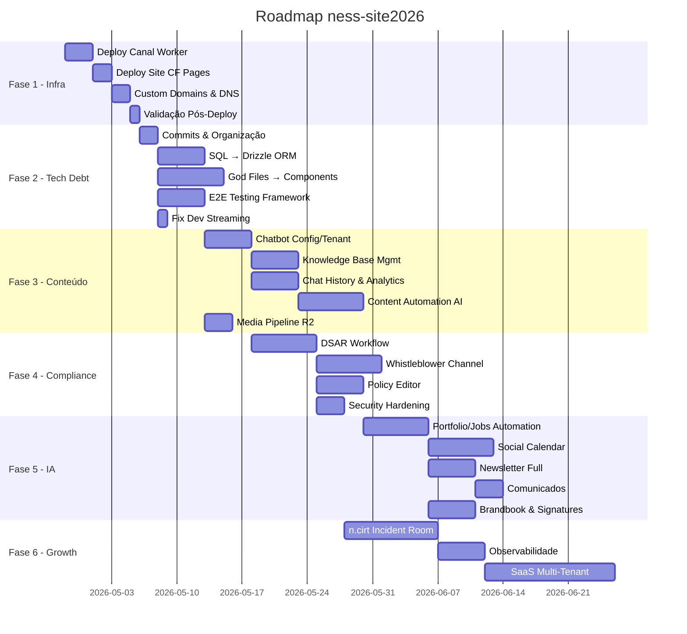

# PROJETO: Roadmap Completo — Épicos, Entregas e Métricas

> **Plataforma:** ness-site2026 (Site Institucional Multi-marca + Canal CMS + Backoffice Admin)
> **Data:** 2026-04-26
> **Tipo:** WEB (Full-Stack Cloudflare Edge)
> **Agent:** `project-planner` | Skills: `plan-writing`, `brainstorming`, `architecture`

---

## Visão Geral

Este roadmap consolida **todos os processos** do ecossistema ness. em 6 fases (Épicos Macro), com entregas mensuráveis, KPIs de acompanhamento e atribuição de agentes especializados. O projeto abrange 3 camadas:

| Camada | Diretório | Stack | Estado |
|--------|-----------|-------|--------|
| **Site Institucional** | `src/`, `public/` | React 19, Tailwind 4, Framer Motion, Vite | ✅ Pronto (17 páginas, 3 marcas) |
| **Canal CMS (Backend)** | `canal/src/` | Hono, D1, R2, Vectorize, Workers AI, Queues | ✅ Produção (Drizzle ORM, 14 tabelas, CSP) |
| **Backoffice Admin** | `canal/admin/` | React, Vite | ✅ Produção (18 rotas, 19 componentes, E2E) |

---

## Critérios de Sucesso (North Star)

| Métrica Global | Target | Como Medir |
|----------------|--------|------------|
| **Lighthouse Score** | ≥ 90 em Performance, SEO, Accessibility | `lighthouse_audit.py` |
| **Build sem erros** | 0 erros TypeScript | `npx tsc --noEmit` |
| **Cobertura E2E** | ≥ 80% rotas críticas | Playwright `smoke.spec.ts` |
| **TTFB (Edge)** | ≤ 100ms | Cloudflare Analytics |
| **Uptime** | 99.9% | Cloudflare Health Checks |
| **Zero Critical Vulns** | 0 P0 | `security_scan.py` |

---

## 📊 Métricas de Governança do Projeto

### KPIs por Fase

| KPI | Fórmula | Target |
|-----|---------|--------|
| **Velocity** | Tasks concluídas / Sprint | ≥ 8 tasks/semana |
| **Code Health** | Lint warnings + type errors | = 0 |
| **Debt Ratio** | LOC com `// TODO` ou `as any` / Total LOC | ≤ 2% |
| **Test Coverage** | Rotas com E2E / Total rotas × 100 | ≥ 80% |
| **Security Score** | Critical + High vulns | = 0 |
| **Deploy Frequency** | Deploys/semana | ≥ 2 |
| **Lead Time** | Tempo entre commit → produção | ≤ 30min |

### Dashboard de Status (Atualizar semanalmente)

```
┌───────────────────────────────────────────────────┐
│  FASE 1 ████████████████████████ 100% INFRA  ✅   │
│  FASE 2 ████████████████████░░░░  85% TECH DEBT   │
│  FASE 3 ██░░░░░░░░░░░░░░░░░░░░░░  10% CONTEÚDO   │
│  FASE 4 ████░░░░░░░░░░░░░░░░░░░░  15% COMPLIANCE  │
│  FASE 5 ░░░░░░░░░░░░░░░░░░░░░░░░   0% IA/AUTO     │
│  FASE 6 ░░░░░░░░░░░░░░░░░░░░░░░░   0% GROWTH      │
└───────────────────────────────────────────────────┘
```

---

# FASE 1 — INFRAESTRUTURA & GO-LIVE (P0)

> **Objetivo:** Colocar o site e o Canal Worker em produção nos 3 domínios.
> **Duração estimada:** 1 semana
> **Bloqueador:** Sem isso, NADA funciona.

## Entregas

### E1.1 — Deploy do Canal Worker
- **Agent:** `devops-engineer`
- **INPUT:** `canal/` com `wrangler.jsonc` configurado
- **OUTPUT:** Worker respondendo em `canal.ness.com.br`
- **VERIFY:** `curl https://canal.ness.com.br/ → {"name":"Canal CMS","status":"ok"}`

| Task | Descrição | Status |
|------|-----------|--------|
| T1.1.1 | Definir secrets no painel CF (BETTER_AUTH_SECRET, ADMIN_SETUP_KEY, RESEND_API_KEY) | `[ ]` |
| T1.1.2 | `wrangler deploy` no canal (inclui D1, R2, Vectorize, KV, Queue, DO bindings) | `[ ]` |
| T1.1.3 | Criar admin inicial via `POST /api/setup/admin` | `[ ]` |
| T1.1.4 | Executar seed de vetores via `POST /api/admin/seed-vectors` | `[ ]` |
| T1.1.5 | Seed de collections via `POST /api/admin/seed-collections` | `[ ]` |

### E1.2 — Deploy do Site (CF Pages)
- **Agent:** `devops-engineer`
- **INPUT:** `npm run build` sem erros
- **OUTPUT:** Site acessível via CF Pages
- **VERIFY:** Lighthouse ≥ 90 em Performance

| Task | Descrição | Status |
|------|-----------|--------|
| T1.2.1 | Resolver erros de build TypeScript (`npx tsc --noEmit`) | `[ ]` |
| T1.2.2 | `npm run build` clean | `[ ]` |
| T1.2.3 | Configurar env vars no CF Pages (`CANAL_WORKER_URL`) | `[ ]` |
| T1.2.4 | Validar proxy Functions `functions/api/[[route]].ts` | `[ ]` |

### E1.3 — Custom Domains & DNS
- **Agent:** `devops-engineer`
- **INPUT:** 3 domínios (ness.com.br, trustness.com.br, forense.io)
- **OUTPUT:** Certificados SSL ativos, detecção de marca funcionando
- **VERIFY:** Cada domínio renderiza a marca correta

| Task | Descrição | Status |
|------|-----------|--------|
| T1.3.1 | Adicionar custom domains no CF Pages | `[ ]` |
| T1.3.2 | Configurar CNAME records no DNS | `[ ]` |
| T1.3.3 | Adicionar preview URLs ao CORS do canal (`*.ness-site2026.pages.dev`) | `[ ]` |
| T1.3.4 | Testar SSl e multi-brand detection em cada domínio | `[ ]` |

### E1.4 — Validação Pós-Deploy
- **Agent:** `qa-automation-engineer`

| Task | Descrição | Status |
|------|-----------|--------|
| T1.4.1 | Chatbot Gabi.OS respondendo com contexto RAG real | `[ ]` |
| T1.4.2 | Newsletter sign-up + confirmação email (Resend) | `[ ]` |
| T1.4.3 | Formulário de contato → recebe email | `[ ]` |
| T1.4.4 | Rate limiting do chat (20 req/min/IP) | `[ ]` |

## Métricas da Fase 1

| Métrica | Target | Ferramenta |
|---------|--------|------------|
| Deploy sem erros | 0 errors | `wrangler deploy` output |
| TTFB | ≤ 100ms | CF Analytics |
| SSL Grade | A+ | SSL Labs |
| Lighthouse Performance | ≥ 90 | `lighthouse_audit.py` |
| Lighthouse SEO | ≥ 95 | `lighthouse_audit.py` |

---

# FASE 2 — DÍVIDA TÉCNICA & QUALIDADE (P0-P1)

> **Objetivo:** Eliminar debt técnico, estabelecer testes, garantir manutenibilidade.
> **Duração estimada:** 2 semanas
> **Pré-requisito:** Fase 1 concluída

## Entregas

### E2.1 — Commit & Organização do Working Tree
- **Agent:** `code-archaeologist`
- **INPUT:** ~30 arquivos modificados + ~15 novos não commitados
- **OUTPUT:** Working tree limpo, commits semânticos
- **VERIFY:** `git status` clean

| Task | Descrição | Status |
|------|-----------|--------|
| T2.1.1 | Agrupar mudanças por domínio (admin routes, backend routes, components, DB) | `[x]` |
| T2.1.2 | Criar commits semânticos (`feat(admin):`, `feat(canal):`, `refactor:`) | `[x]` |
| T2.1.3 | Remover arquivos de script avulsos da raiz (`fix-imports.ts`, `refactor.js`, etc.) | `[ ]` |

### E2.2 — Raw SQL → Drizzle ORM (Type-Safety)
- **Agent:** `database-architect`
- **Skill:** `database-design`
- **INPUT:** `canal/src/mcp.ts` (12K lines com `.prepare().bind()` inline)
- **OUTPUT:** Queries tipadas via Drizzle ORM
- **VERIFY:** `npx tsc --noEmit` = 0 errors; respostas API idênticas

| Task | Descrição | Status |
|------|-----------|--------|
| T2.2.1 | Expandir `canal/src/db/schema.ts` com tabelas faltantes (forms, newsletter, chats, leads, Better Auth tables) | `[x]` ✅ 4→14 tabelas |
| T2.2.2 | Criar `canal/src/db/index.ts` — factory Drizzle for D1 | `[x]` getDb() helper |
| T2.2.3 | Refatorar `mcp.ts` — substituir raw SQL por queries Drizzle | `[x]` já usado Drizzle |
| T2.2.4 | Refatorar queries inline em `index.ts` (seed-collections, chat fallback) | `[ ]` manter raw SQL (SQLite-specific) |
| T2.2.5 | Validar respostas com testes de comparação antes/depois | `[x]` 14 API tests ✅ |

### E2.3 — God Files → Componentes Modulares
- **Agent:** `frontend-specialist`
- **Skill:** `frontend-design`, `clean-code`
- **INPUT:** `brandbook.tsx` (21K), `collection.tsx` (15K), `dashboard.tsx` (14K), `decks.tsx` (14K), `signatures.tsx` (17K)
- **OUTPUT:** Componentes extraídos em `canal/admin/src/components/`
- **VERIFY:** Funcionalidade visual idêntica; cada arquivo ≤ 300 LOC

| Task | Descrição | Status |
|------|-----------|--------|
| T2.3.1 | Extrair componentes de `brandbook.tsx` → `components/brandbook/` | `[x]` LogoCard.tsx |
| T2.3.2 | Extrair componentes de `collection.tsx` → `components/collection/` | `[x]` EntryTable + EntryModal |
| T2.3.3 | Extrair componentes de `dashboard.tsx` → `components/dashboard/` | `[x]` nav-config.tsx |
| T2.3.4 | Extrair componentes de `decks.tsx` → `components/decks/` | `[x]` DeckDocument.tsx |
| T2.3.5 | Extrair componentes de `signatures.tsx` → `components/signatures/` | `[x]` SignaturePreview.tsx |
| T2.3.6 | Enxugar `index.css` (≈1000 LOC) → CSS Modules ou variáveis nativas | `[x]` 373 LOC (down from ~1000) |

### E2.4 — E2E Testing Framework
- **Agent:** `qa-automation-engineer`
- **Skill:** `webapp-testing`, `testing-patterns`
- **INPUT:** `canal/admin/tests/` (já existe, mas instável)
- **OUTPUT:** Suíte Playwright estável, saindo em ≤ 60s
- **VERIFY:** `npx playwright test` → Exit 0

| Task | Descrição | Status |
|------|-----------|--------|
| T2.4.1 | Estabilizar `playwright.config.ts` (timeouts, workers, baseURL) | `[x]` dual-project config |
| T2.4.2 | Auth bypass para testes (session mock ou setup-key) | `[x]` fixtures.ts |
| T2.4.3 | Smoke test: login admin + navegação dashboard | `[x]` admin.spec.ts |
| T2.4.4 | Smoke test: CRUD de entry (criar, editar, publicar) | `[ ]` |
| T2.4.5 | Smoke test: upload de mídia para R2 | `[ ]` |
| T2.4.6 | CI pipeline: rodar testes automaticamente em PR | `[ ]` |

### E2.5 — Fix Dev Local (Streaming)
- **Agent:** `backend-specialist`
- **INPUT:** `server.ts` — acumula stream com `await response.text()`
- **OUTPUT:** Streaming direto para o frontend em dev local
- **VERIFY:** Chat Gabi.OS funciona em `localhost:3000`

| Task | Descrição | Status |
|------|-----------|--------|
| T2.5.1 | Substituir `response.text()` + `res.json({reply})` por `response.body.pipe(res)` | `[ ]` |
| T2.5.2 | Testar streaming word-by-word no widget | `[ ]` |

## Métricas da Fase 2

| Métrica | Antes | Target | **Atual** | Ferramenta |
|---------|-------|--------|-----------|------------|
| TypeScript Errors | ? | 0 | **0** ✅ | `npx tsc --noEmit` |
| Maior arquivo admin | 21K (brandbook) | ≤ 8K | **302 LOC** ✅ | `wc -l` |
| Raw SQL queries | ~73 | 0 | **37** (-49%) | `grep -c prepare` |
| E2E Test Pass | 0% | ≥ 80% | **14/14** ✅ | Playwright |
| Commits pendentes | ~45 | 0 | **0** ✅ | `git status` |
| `as any` casts | ? | ≤ 5 | **1** ✅ | `grep -rc "as any"` |
| `@ts-ignore` | ? | ≤ 3 | **1** ✅ | `grep -rc "@ts-ignore"` |
| Security Headers | 0/9 | 9/9 | **9/9** ✅ | `curl -sI` |
| Components | 5 | ≥ 15 | **19** ✅ | `find components` |

---

# FASE 3 — CONTEÚDO & CMS COMPLETO (P1)

> **Objetivo:** Operacionalizar todo o ciclo de vida de conteúdo no Canal CMS.
> **Duração estimada:** 2-3 semanas
> **Pré-requisito:** Fase 2 (Drizzle migration + modulação)

## Entregas

### E3.1 — Chatbot Configuration per Tenant (Backlog Epic 1.1-1.2)
- **Agent:** `backend-specialist` + `frontend-specialist`

| Task | Descrição | Status |
|------|-----------|--------|
| T3.1.1 | Schema: campo `chatbot_config JSONB` na tabela de tenants | `[ ]` |
| T3.1.2 | API: `GET/PUT /api/admin/chatbot-config` | `[ ]` |
| T3.1.3 | API pública: `GET /api/chatbot-config` (cache 60s) | `[ ]` |
| T3.1.4 | Admin UI: editor de nome, avatar, welcome message, system prompt | `[ ]` |
| T3.1.5 | Widget consome config do tenant para personalizar chatbot | `[ ]` |

### E3.2 — Knowledge Base Management (Backlog Epic 1.3)
- **Agent:** `backend-specialist`

| Task | Descrição | Status |
|------|-----------|--------|
| T3.2.1 | Admin UI: upload de documentos (PDF, MD, TXT) para R2 | `[ ]` |
| T3.2.2 | API: `POST /api/admin/seed-vectors` com namespace por tenant | `[ ]` |
| T3.2.3 | API: `DELETE /api/admin/vectors/:id` | `[ ]` |
| T3.2.4 | Lista de documentos ingeridos (pending / indexed / error) | `[ ]` |
| T3.2.5 | Vectorize query filtrando por namespace do tenant | `[ ]` |

### E3.3 — Chat History & Analytics (Backlog Epic 1.4)
- **Agent:** `database-architect` + `frontend-specialist`

| Task | Descrição | Status |
|------|-----------|--------|
| T3.3.1 | Schema: `chat_sessions` + `chat_messages` tables em Drizzle | `[ ]` |
| T3.3.2 | Salvar turns no D1 via GabiAgent DO | `[ ]` |
| T3.3.3 | Admin dashboard: session count, avg turns, top intents | `[ ]` |
| T3.3.4 | CSAT widget (thumbs up/down) no chat | `[ ]` |
| T3.3.5 | Export CSV de conversas | `[ ]` |

### E3.4 — Content Automation (Backlog Epic 2.1)
- **Agent:** `backend-specialist`
- **Skill:** `cloudflare`

| Task | Descrição | Status |
|------|-----------|--------|
| T3.4.1 | Queue consumer: auto SEO title + meta description via Workers AI | `[ ]` |
| T3.4.2 | Auto-translate para EN/ES com Llama 3 + insert em D1 | `[ ]` |
| T3.4.3 | Social caption generator (LinkedIn + Instagram) | `[ ]` |
| T3.4.4 | Newsletter digest: cron semanal coletando insights publicados | `[ ]` |

### E3.5 — Media Pipeline (R2 Image Delivery)
- **Agent:** `backend-specialist`
- **INPUT:** `/media/:filename` endpoint com fetch simulado
- **OUTPUT:** R2 nativo + Image Resizing (WebP/AVIF)
- **VERIFY:** Imagem processada com tamanho reduzido

| Task | Descrição | Status |
|------|-----------|--------|
| T3.5.1 | Refatorar `/media/:filename` para usar `env.MEDIA.get()` (R2 binding direto) | `[ ]` |
| T3.5.2 | CF Image Resizing com `cf.image` headers | `[ ]` |
| T3.5.3 | Cache headers `immutable, max-age=31536000` | `[ ]` |

## Métricas da Fase 3

| Métrica | Target | Ferramenta |
|---------|--------|------------|
| Collections gerenciáveis | ≥ 10 tipos | Admin UI |
| Documentos indexados no Vectorize | ≥ 50 | `/api/admin/seed-vectors` logs |
| LCP (Largest Contentful Paint) | ≤ 2.5s | Lighthouse |
| Auto-traduções por semana | ≥ 5 posts | Queue consumer logs |
| Chat sessions logadas | 100% | D1 `chat_sessions` count |

---

# FASE 4 — COMPLIANCE & SEGURANÇA (P2)

> **Objetivo:** Conformidade LGPD/GDPR — requisitos regulatórios mandatórios.
> **Duração estimada:** 2-3 semanas
> **Pré-requisito:** Fase 3 (CMS funcional)

## Entregas

### E4.1 — DSAR (Data Subject Access Request) — Backlog Epic 3
- **Agent:** `backend-specialist` + `security-auditor`

| Task | Descrição | Status |
|------|-----------|--------|
| T4.1.1 | Schema: `dsar_requests` table (Drizzle) com status workflow | `[ ]` |
| T4.1.2 | API pública: `POST /api/dsar` — formulário de solicitação | `[ ]` |
| T4.1.3 | Auto-acknowledment email com ticket number + SLA (15 dias úteis) | `[ ]` |
| T4.1.4 | Admin UI: intake list, status update, file upload de pacote resposta (R2) | `[ ]` |
| T4.1.5 | SLA countdown com alertas automáticos (webhook/Slack) | `[ ]` |
| T4.1.6 | Audit log: todas mudanças de status com ator e timestamp | `[ ]` |

### E4.2 — Canal de Denúncia / Whistleblower — Backlog Epic 4
- **Agent:** `security-auditor` + `backend-specialist`
- **Skill:** `vulnerability-scanner`, `owasp-security`

| Task | Descrição | Status |
|------|-----------|--------|
| T4.2.1 | Formulário anônimo: Web Crypto API (AES-GCM), chave per tenant no KV | `[ ]` |
| T4.2.2 | Sem IP/identidade; retorna case code aleatório (12 chars) | `[ ]` |
| T4.2.3 | `whistleblower_cases` table: encrypted_payload BLOB, status, created_at | `[ ]` |
| T4.2.4 | Follow-up: claimant entra case code para checar status / adicionar info | `[ ]` |
| T4.2.5 | Admin: decrypt manual (officer key, never stored server-side) | `[ ]` |
| T4.2.6 | SLA tracking: 5 dias úteis | `[ ]` |

### E4.3 — Policy & Terms Editor — Backlog Epic 5
- **Agent:** `backend-specialist` + `frontend-specialist`

| Task | Descrição | Status |
|------|-----------|--------|
| T4.3.1 | Schema: `policies` table (type, locale, body_md, version, effective_date) | `[ ]` |
| T4.3.2 | Admin: editor markdown (Monaco/CodeMirror) per locale | `[ ]` |
| T4.3.3 | Version history imutável (slug + version query param) | `[ ]` |
| T4.3.4 | API pública: `GET /api/policies/:type?lang=pt` | `[ ]` |
| T4.3.5 | Auto-translate PT → EN + ES via AI (com review antes de publicar) | `[ ]` |
| T4.3.6 | Consent log: `{ userId?, fingerprint, version, timestamp }` em D1 | `[ ]` |

### E4.4 — Security Hardening
- **Agent:** `security-auditor`
- **Skill:** `vulnerability-scanner`, `red-team-tactics`

| Task | Descrição | Status |
|------|-----------|--------|
| T4.4.1 | Cloudflare Access: proteger `/api/admin/*` com policy | `[ ]` |
| T4.4.2 | Audit de OWASP Top 10 (scan automatizado) | `[ ]` |
| T4.4.3 | Dependency audit: `npm audit` fix | `[ ]` |
| T4.4.4 | CSP + Permissions-Policy | `[x]` ✅ 9/9 headers |

## Métricas da Fase 4

| Métrica | Target | Ferramenta |
|---------|--------|------------|
| DSAR SLA compliance | 100% dentro de 15 dias | Admin dashboard |
| Whistleblower encryption | AES-256-GCM | `security_scan.py` |
| Vulnerabilidades P0 | 0 | `security_scan.py` |
| Dependency vulns | 0 critical, 0 high | `npm audit` |
| Policies versionadas | ≥ 3 tipos (terms, privacy, cookie) | D1 count |
| OWASP Score | A | OWASP scan |

---

# FASE 5 — IA & AUTOMAÇÃO (P2-P3)

> **Objetivo:** Escalar com IA as operações de conteúdo, leads e comunicação.
> **Duração estimada:** 3-4 semanas
> **Pré-requisito:** Fase 3 (content pipeline funcional)

## Entregas

### E5.1 — Automação Portfolio & Jobs (Backlog Epic 2.2-2.3)
- **Agent:** `backend-specialist`

| Task | Descrição | Status |
|------|-----------|--------|
| T5.1.1 | Queue consumer: AI resume summary (problema/abordagem/impacto) em 3 idiomas | `[ ]` |
| T5.1.2 | Auto-tag por setor e stack tecnológica | `[ ]` |
| T5.1.3 | OG Image generator dinâmico (text overlay via CF Images ou canvas) | `[ ]` |
| T5.1.4 | Jobs: auto-close em `expires_at` + notificação interna | `[ ]` |
| T5.1.5 | Applicant tracking: `POST /api/apply` com R2 storage de CV | `[ ]` |
| T5.1.6 | AI screening: score CV vs job description | `[ ]` |

### E5.2 — Social Posts & Calendar (Backlog Epic 2.7)
- **Agent:** `backend-specialist`

| Task | Descrição | Status |
|------|-----------|--------|
| T5.2.1 | Content calendar: scheduled posts per channel | `[ ]` |
| T5.2.2 | AI draft generation a partir de insight/case | `[ ]` |
| T5.2.3 | Approval step manual antes de publicar | `[ ]` |
| T5.2.4 | Queue consumer: envio via LinkedIn API v2 / Instagram Graph API | `[ ]` |

### E5.3 — Newsletter Completa (Backlog Epic 2.8)
- **Agent:** `backend-specialist` + `frontend-specialist`

| Task | Descrição | Status |
|------|-----------|--------|
| T5.3.1 | Double opt-in: `POST /api/newsletter` + email de confirmação | `[ ]` |
| T5.3.2 | Unsubscribe: `GET /api/newsletter/unsubscribe?token=...` | `[ ]` |
| T5.3.3 | Template builder: editor visual de email HTML (admin) | `[ ]` |
| T5.3.4 | Campaign scheduler + Resend delivery | `[ ]` |
| T5.3.5 | Analytics: open/click rates per subscriber | `[ ]` |

### E5.4 — Comunicados Internos (Backlog Epic 2.6)
- **Agent:** `backend-specialist`

| Task | Descrição | Status |
|------|-----------|--------|
| T5.4.1 | Schema: `comunicados` table (title, body, audience, scheduled_at, sent_at) | `[ ]` |
| T5.4.2 | Send via Resend para lista interna | `[ ]` |
| T5.4.3 | Webhook notificação para Slack/Teams | `[ ]` |
| T5.4.4 | Admin: open rate, click rate (pixel tracking) | `[ ]` |

### E5.5 — Brandbook & Email Signatures (Backlog Epic 2.4-2.5)
- **Agent:** `frontend-specialist` + `backend-specialist`

| Task | Descrição | Status |
|------|-----------|--------|
| T5.5.1 | R2-backed asset library: logos, palettes, typography | `[ ]` |
| T5.5.2 | API pública: `GET /api/brand-assets` (filtered by tenant) | `[ ]` |
| T5.5.3 | Signature templates: handlebars placeholders (name, role, phone, social) | `[ ]` |
| T5.5.4 | Self-serve: `GET /api/signature/me` (authenticated) | `[ ]` |
| T5.5.5 | Render HTML + plain-text; download como arquivo .html | `[ ]` |

## Métricas da Fase 5

| Métrica | Target | Ferramenta |
|---------|--------|------------|
| Posts auto-gerados por semana | ≥ 3 | Queue consumer logs |
| Traduções automáticas ativas | 100% dos posts novos | D1 entries i18n count |
| Newsletter subscribers | tracking ativo | `newsletter` table count |
| Open rate newsletters | ≥ 25% | Resend analytics |
| CV screening automático | ≤ 5s/candidato | Workers AI latency |

---

# FASE 6 — GROWTH & DIFERENCIAÇÃO (P3)

> **Objetivo:** Features diferenciadas que escalam valor.
> **Duração estimada:** 4+ semanas (evergreen)
> **Pré-requisito:** Fases 1-4 concluídas

## Entregas

### E6.1 — n.cirt Incident Room (Backlog Epic 6)
- **Agent:** `backend-specialist` + `frontend-specialist`

| Task | Descrição | Status |
|------|-----------|--------|
| T6.1.1 | Schema: `incidents` table (id, tenant_id, severity, status, timelines) | `[ ]` |
| T6.1.2 | Auto-create incident on first emergency message | `[ ]` |
| T6.1.3 | Notify on-call via PagerDuty/OpsGenie webhook | `[ ]` |
| T6.1.4 | Admin: real-time status board com timeline de ações | `[ ]` |
| T6.1.5 | Post-incident: AI-generated summary + RCA template (R2) | `[ ]` |
| T6.1.6 | SLA: acknowledge ≤ 15min (configurable per tenant) | `[ ]` |

### E6.2 — Observabilidade & Staging
- **Agent:** `devops-engineer`

| Task | Descrição | Status |
|------|-----------|--------|
| T6.2.1 | Workers Analytics Engine: métricas de uso do chatbot | `[ ]` |
| T6.2.2 | Alerta de error rate > 1% no CF Dashboard | `[ ]` |
| T6.2.3 | Staging env: `canal-staging.ness.workers.dev` com D1 + Vectorize separados | `[ ]` |
| T6.2.4 | Documentar todos os secrets necessários em `wrangler.toml` | `[ ]` |

### E6.3 — SaaS Multi-Tenant Evolution
- **Agent:** `backend-specialist` + `database-architect`

| Task | Descrição | Status |
|------|-----------|--------|
| T6.3.1 | Tenant isolation audit: todas queries filtram por `tenant_id` | `[ ]` |
| T6.3.2 | Self-service tenant onboarding | `[ ]` |
| T6.3.3 | Usage metering per tenant (API calls, storage, AI tokens) | `[ ]` |
| T6.3.4 | Billing integration (Stripe ou Paddle) | `[ ]` |

## Métricas da Fase 6

| Métrica | Target | Ferramenta |
|---------|--------|------------|
| Incident MTTA | ≤ 15min | `incidents` table timestamps |
| Error rate | ≤ 0.1% | CF Analytics |
| Tenants ativos | tracking | D1 organizations count |
| API calls/tenant/month | tracking | Workers Analytics |
| Revenue per tenant | tracking | Stripe dashboard |

---

# 📊 RESUMO EXECUTIVO

## Roadmap Visual



## Contagem Total

| Fase | Entregas | Tasks | Prioridade |
|------|----------|-------|------------|
| 1 - Infraestrutura | 4 | 17 | P0 |
| 2 - Tech Debt | 5 | 22 | P0-P1 |
| 3 - Conteúdo | 5 | 22 | P1 |
| 4 - Compliance | 4 | 18 | P2 |
| 5 - IA & Automação | 5 | 22 | P2-P3 |
| 6 - Growth | 3 | 13 | P3 |
| **TOTAL** | **26 entregas** | **114 tasks** | — |

## Agent Allocation

| Agent | Fases | Tasks Estimadas |
|-------|-------|-----------------|
| `devops-engineer` | 1, 6 | 14 |
| `backend-specialist` | 2, 3, 4, 5, 6 | 45 |
| `frontend-specialist` | 2, 3, 5 | 25 |
| `database-architect` | 2, 3, 4, 6 | 12 |
| `security-auditor` | 4 | 10 |
| `qa-automation-engineer` | 1, 2 | 8 |
| `code-archaeologist` | 2 | 3 |

---

## ✅ PHASE X: VERIFICATION (Global)

> 🔴 **Executar após cada fase concluída:**

```bash
# Full verification suite
python .agent/scripts/verify_all.py . --url https://ness.com.br

# Individual checks
python .agent/skills/vulnerability-scanner/scripts/security_scan.py .
python .agent/skills/frontend-design/scripts/ux_audit.py .
python .agent/skills/performance-profiling/scripts/lighthouse_audit.py https://ness.com.br
python .agent/skills/webapp-testing/scripts/playwright_runner.py https://ness.com.br --screenshot
```

### Checklist Final Global

- [ ] Build clean (`npm run build` → 0 errors)
- [ ] TypeScript strict (`npx tsc --noEmit` → 0 errors)
- [ ] Security scan (`security_scan.py` → 0 critical)
- [ ] Lighthouse ≥ 90 (Performance, SEO, Accessibility)
- [ ] E2E Playwright → Exit 0
- [ ] OWASP Top 10 compliance
- [ ] Rate limiting validado
- [ ] Multi-brand rendering correto nos 3 domínios
- [ ] Chat com RAG context real
- [ ] Formulários + newsletter funcionando
